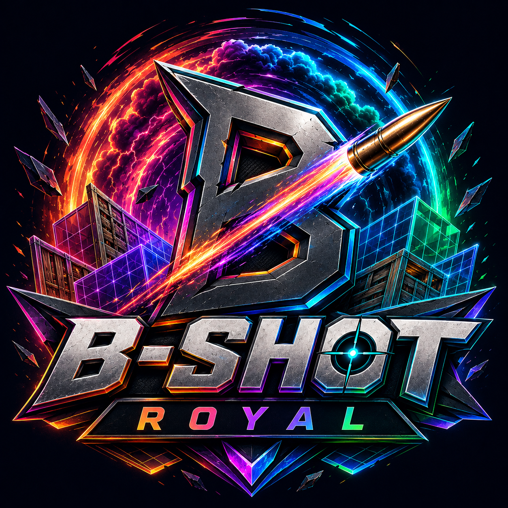

<div align="center">



# B-Shot Royal

**A Fortnite-style battle royale you can play in your browser.**

*Loot. Build. Survive the storm. Eliminate them all for the B-Shot Victory.*

[](https://djrex500.github.io/bshot-royale/)


**[▶ Play now](https://djrex500.github.io/bshot-royale/)** — no install, runs in the browser.

</div>

---

## 🚀 Quick Start

**Play now:** [https://djrex500.github.io/bshot-royale/](https://djrex500.github.io/bshot-royale/)

Open the link, hit **Drop In**, and click the game screen once to capture your mouse.

### Run locally

**Option 1 — double-click `start.bat`** *(easiest on Windows)*

**Option 2 — terminal:**

```bash
npm install
npm run dev
```

The local server is at `http://localhost:5173`.

---

## 🎮 Controls

| Key | Action |
|:---:|--------|
| `W` `A` `S` `D` | Move |
| `Shift` | Sprint |
| `Space` | Jump |
| `LMB` | Shoot / Place build *(hold for turbo build)* |
| `RMB` | Aim down sights / Rotate build piece |
| `B` | Toggle build mode |
| `F` | Harvest wood & stone |
| `E` | Open chest |
| `1` `2` `3` | Weapon or build piece |
| `Scroll` | Cycle weapons / pieces |
| `R` | Reload |

---

## ✨ Features

### 🔫 Combat
- **3 weapons** — Assault Rifle, Pump Shotgun, Bolt Sniper with unique stats and models
- **ADS scoping** — right-click to aim, full sniper scope overlay
- **Headshots** — bonus damage, hit markers, and a big *HEADSHOT!* popup
- **Combat juice** — muzzle flash, tracers, impact sparks, and sound effects

### 🧱 Building
- **Fortnite-style grid building** — walls, floors, and ramps that snap together
- **Turbo build** — hold click to spam pieces
- **Destructible** — builds have HP and break under fire

### 🌍 The Island
- **400m open world** with 5 named POIs (Tilted, Retail, Pleasant, Salty, Center)
- **Loot everywhere** — golden chests, ground loot, shield potions, medkits
- **Harvesting** — swing at trees and rocks for building materials
- **Shrinking storm** — stay in the zone or take damage, with visible storm wall

### 🤖 The Enemies
- **AI bots with guns** — they chase, shoot, and flank
- **8 unique skins** — Renegade, Shadow, Toxic, Blaze, Ghost, Violet, Gold & more
- **Bot loot drops** — eliminated bots drop materials, ammo, and shields
- **Victory Royale** — wipe the lobby to win

### 🎛️ Quality of Life
- **Minimap** with storm circle, bots, and POI names
- **Settings menu** — bot toggle, mouse sensitivity, storm speed, volume
- **Health + shield** — Fortnite-style damage absorption

---

## 🛠️ Tech Stack

| Tech | Role |
|------|------|
| [Three.js](https://threejs.org/) | 3D rendering |
| [Cannon-es](https://pmndrs.github.io/cannon-es/) | Physics |
| [Vite](https://vitejs.dev/) | Dev server & bundling |
| Web Audio API | Procedural sound effects |

No game engine, no asset downloads — everything is generated in code, including textures.

---

## 📄 License

[MIT](LICENSE) © 2026 DJrex500
